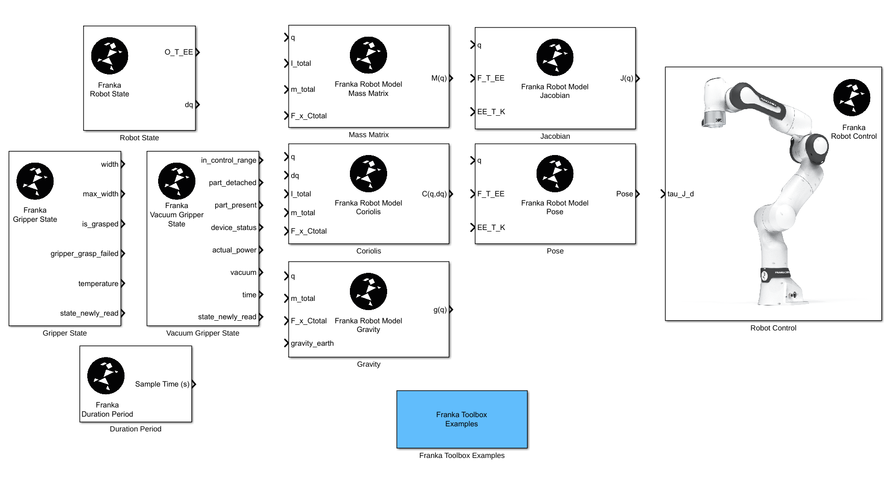

# Franka Toolbox for MATLAB

**MATLAB® & Simulink® integration for the Franka Robot**

## Get Started in Minutes

Pre-built toolbox packages are available on the [**GitHub Releases**](releases) page — no compilation required!

| Package | Robot | Description |
|---------|-------|-------------|
| `franka-fr3.mltbx` | FR3 (Franka Research 3) | For current-generation robots |
| `franka-fer.mltbx` | FER | For first-generation robots |

### Installation

1. Download the appropriate `.mltbx` file from [Releases](releases)
2. Double-click the file, or drag-and-drop it into MATLAB
3. Run `franka_toolbox_install()` in MATLAB

That's it! You're ready to control your Franka robot from MATLAB and Simulink.

## Features

- **Simulink Library** — Ready-to-use blocks for robot state, gripper control, dynamics (mass matrix, Coriolis, gravity, Jacobian), and real-time control
- **MATLAB Classes** — `FrankaRobot`, `FrankaGripper`, and `FrankaVacuumGripper` for programmatic robot control
- **Simulink Coder Support** — Generate and deploy C++ code to real-time Linux targets
- **Cross-Platform** — Works on Windows and Linux, targets x86_64 and ARM64 (Jetson)

## Documentation

**[Franka Toolbox for MATLAB Documentation](https://frankarobotics.github.io/docs/franka_toolbox_for_matlab/docs/franka_matlab/index.html)**
  - Installation & getting started
  - Simulink block reference
  - MATLAB API reference
  - Troubleshooting

**[Franka Control Interface (FCI) Documentation](https://frankarobotics.github.io/docs/index.html)**
  - Robot setup & network configuration
  - libfranka reference
  - System requirements

## Examples

The toolbox includes ready-to-run examples:

- Joint & Cartesian motion generation
- Impedance control (joint & Cartesian)
- Force control
- Gripper operations
- Pick-and-place with RRT path planning

## Building from Source

If you need to build the toolbox yourself, see the [Custom Build Guide](https://frankarobotics.github.io/docs/franka_toolbox_for_matlab/docs/franka_matlab/custom_build.html) in the documentation.

## License

Copyright © 2025 Franka Robotics GmbH
