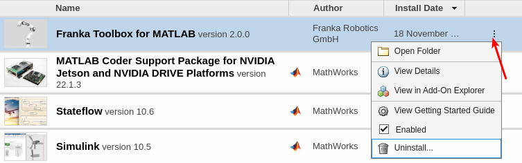

Installation
============

Toolbox Add-On Installation Methods
-----------------------------------

Option 1: Drag and drop the franka.mltbx file
^^^^^^^^^^^^^^^^^^^^^^^^^^^^^^^^^^^^^^^^^^^^^
Drag and drop the ``franka.mltbx`` file into your MATLAB Command Window or

Option 2: Programmatically
^^^^^^^^^^^^^^^^^^^^^^^^^^
.. code-block:: matlab

    uiopen('<path to your franka.mltbx file>', 1);

Install
---------

After adding the Toolbox Add-On to MATLAB, you can install it by executing the following command:

.. code-block:: matlab

    franka_toolbox_install();

Uninstall
---------

1. Clean-up local permanent installation artifacts:

.. code-block:: matlab

    franka_toolbox_uninstall();

2. Remove the toolbox using MATLAB Add-Ons Manager.

    Uninstalling the Franka Toolbox.

.. _libfranka_handling_options:

Switching to system-wide libfranka installation (optional)
----------------------------------------------------------

As mentioned in the :ref:`system_dependencies_precompiled_ai_companion` section, the Toolbox ships with a precompiled libfranka and all its 3d party dependencies for the Target PC.

In case of any potential issues with the Toolbox prebuilt dependencies, you can always manually build and install libfranka from source for your system.

In that case, please inform the Toolbox so it will opt for building against the system-wide libfranka installation by executing:

.. code-block:: matlab

    franka_toolbox_libfranka_system_installation_set(true);

This will trigger the Toolbox to build against the system-wide libfranka installation.

For reverting back to the local installation in the scope of the Toolbox, you can execute:

.. code-block:: matlab

    franka_toolbox_libfranka_system_installation_set(false);
